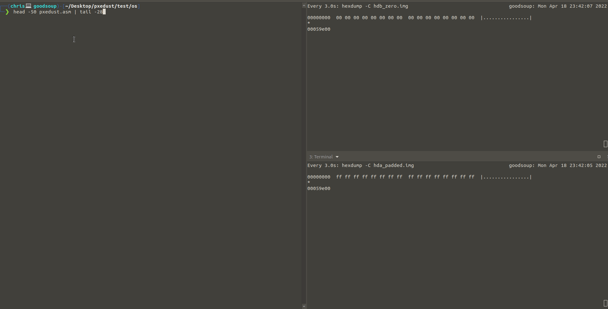

   
  <h1 align="center">
    <a href="https://github.com/christopherwoodall/pxedust">
      PXE Dust
    </a>
  </h1>
  <h3 align="center">
    Under Development
  </h3>

<h4 align="center">Self Contained PXE Server + Bootloader That Destroys Things</h4>

  <a href="#about">About</a> •
  <a href="#demo">Demo</a>

# About

Who needs a 0day when you can boot untrusted code?

# Demo

